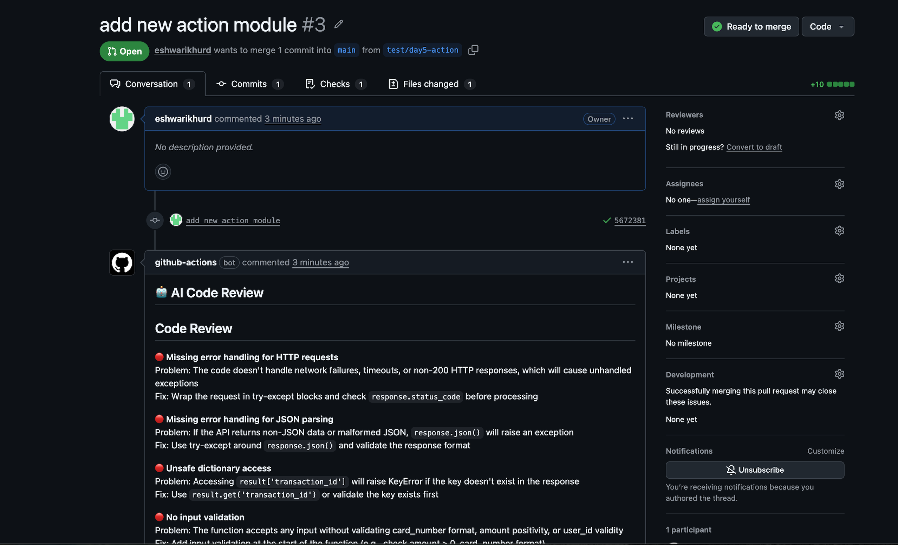
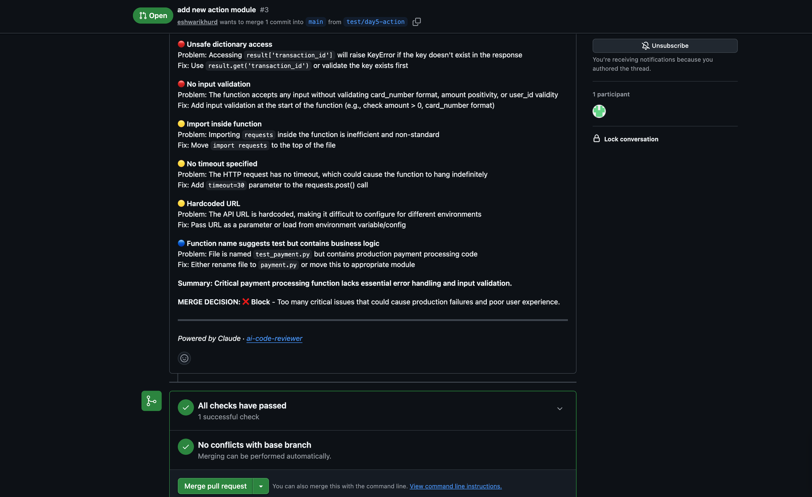

# ai-code-reviewer

Automated PR code reviewer powered by Claude (Anthropic). Opens a pull request → 
GitHub Action triggers → Claude analyzes the diff → structured feedback posted 
as a comment. Zero manual steps.


---

## How it works
1. A pull request is opened or updated on any Python/JS/TS/Java/C++ file
2. GitHub Actions spins up a runner and runs `src/reviewer.py`
3. The script fetches only the added/changed lines from the diff
4. Claude analyzes the code and returns severity-ranked feedback
5. The bot posts a structured comment directly on the PR

---

## Example output
## Example output





---

## Prompt design

Four system prompt variants were tested on the same diff and compared across:
- Coverage — issues found
- Actionability — quality of suggested fixes  
- Signal-to-noise — scannability in a PR comment
- Merge decision — does it give a clear verdict

**Winner: severity-label prompt** using 🔴/🟡/🔵 with mandatory MERGE DECISION.

Full ablation study: [`src/prompts/results.md`](src/prompts/results.md)

---

## Setup

### 1. Clone the repo
```bash
git clone https://github.com/eshwarikhurd/ai-code-reviewer.git
cd ai-code-reviewer
```

### 2. Install dependencies
```bash
python -m venv venv
source venv/bin/activate
pip install -r requirements.txt
```

### 3. Set environment variables
Create a `.env` file:

### 4. Run manually on any PR
```bash
python src/reviewer.py <PR_NUMBER>
```

### 5. Automated via GitHub Actions
Add `ANTHROPIC_API_KEY` to your repo's Settings → Secrets → Actions.
The workflow triggers automatically on every pull request.

---

## Project structure
```
ai-code-reviewer/
├── src/
│   ├── reviewer.py          # core logic — diff fetch, Claude API, PR comment
│   └── prompts/
│       └── results.md       # prompt ablation study
├── .github/
│   └── workflows/
│       └── code-review.yml  # GitHub Actions workflow
├── requirements.txt
└── .env                     # not committed

```
---

## Built by
[Eshwari Khurd](https://linkedin.com/in/eshwarikhurd) — MS CS @ UC Irvine  
Part of a series of solo ML/SDE projects. Next: semantic search engine over document corpora.